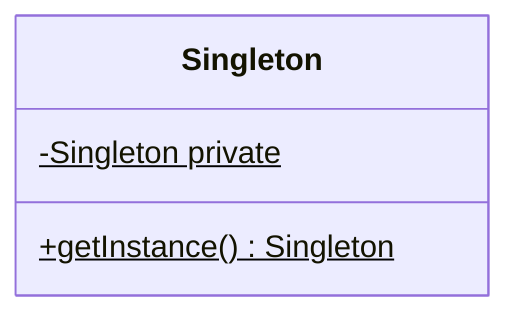

**单例模式**  
保证一个类仅有一个一个实例，并提供一个访问它的全局访问点。

**使用场景**  
单例的使用场景比较多，只要是需要保证全局唯一的都可以考虑使用单例类实现。比如，登录界面，我们一般全局只需要一个登录页面，或者用户的头像，头像可能在很多页面都要用，但是如果大小样式一致的话全局也只要一个即可。

**类图**

```mermaid {theme: 'neutral', scale: 0.8}
classDiagram
      class Singleton
      Singleton : -Singleton private$
      Singleton : +getInstance()$ Singleton
```
